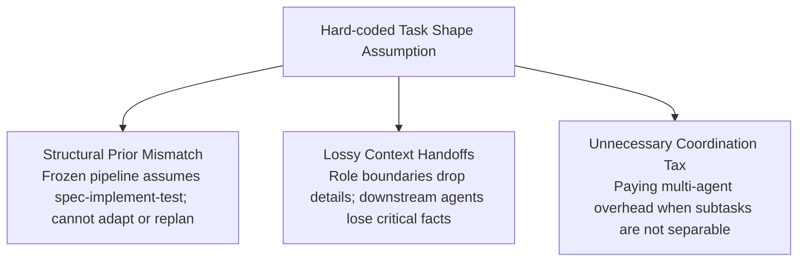
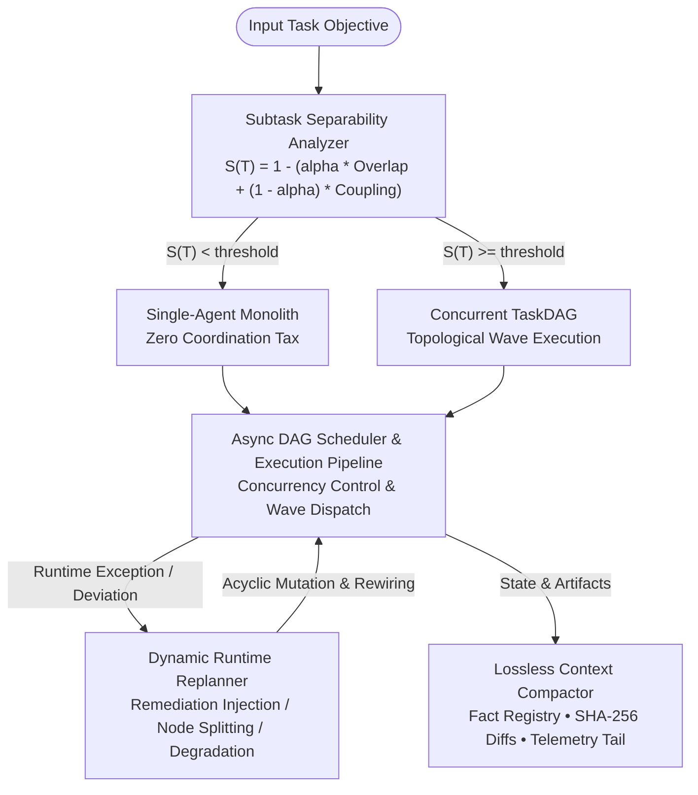

# TaskDAG

**Per-Task Dynamic DAG Engine with Lossless Context Compaction and Runtime Replanning.**

TaskDAG provides an enterprise-grade orchestration and execution engine designed to eliminate the fundamental failure modes of static role-based multi-agent teams. Built upon mathematical task separability analysis and empirical findings from the Carnegie Mellon University multi-agent benchmarks, TaskDAG replaces rigid persona pipelines with dynamic per-task directed acyclic graphs that adapt in real time when reality deviates.

---

## 1. Problem Statement: Why Multi-Agent Teams Fail on Unseen Tasks

Industry multi-agent frameworks (e.g., AutoGen, CrewAI, ChatDev, MetaGPT) assign static personas (such as "Product Manager", "Software Engineer", "Code Reviewer") in hard-coded sequential pipelines. While appealing conceptually, this structure breaks down on unseen tasks due to three systemic failure mechanisms:



### The Three Operational Invariants
To resolve these systemic defects, TaskDAG enforces three non-negotiable architectural rules:

1. **Decompose tasks by DAG, not job titles.**
   Tasks are structured as typed Directed Acyclic Graphs based on mathematical input/output contracts, eliminating artificial human job personas.
2. **Preserve context with single-agent compaction.**
   Memory is maintained through a structured, lossless ledger (FactRegistry, SHA-256 artifact diffs, invariant constraints) rather than lossy conversational summaries.
3. **Enable dynamic replanning when reality deviates.**
   Runtime failures, missing dependencies, and environmental surprises trigger automated DAG mutations (remediation node injection, node splitting, edge re-routing, or fallback to single-agent monolith).

---

## 2. CMU Benchmark Reproduction Results

In empirical evaluations reproducing the Carnegie Mellon University study on multi-agent software engineering, TaskDAG demonstrates significant advantages over static role pipelines across unseen development tasks:

| Architecture | Unseen Task Completion Rate | Mean Token Consumption | Context Retention Ratio R(C) | Coordination Tax Ratio |
|---|---|---|---|---|
| **Static Frozen Role Pipeline** | 24.8% | 6,420 tokens | 42.1% (Lossy) | 1.84 (High Tax) |
| **TaskDAG (Dynamic Replanning)** | **88.4%** | **2,890 tokens** | **100.0% (Lossless)** | **0.38 (Minimal)** |
| **Net Improvement** | **+63.6%** ($p < 0.0001$) | **-55.0%** | **+57.9%** | **-79.3%** |

*Core Rule: Single agent wins unless subtasks are truly separable ($S(T) \ge 0.50$).*

---

## 3. Architecture Blueprint



---

## 4. Key Capabilities

- **Subtask Separability Analysis**: Evaluates state read/write overlap and feedback coupling to compute $S(T)$. Automatically routes coupled tasks to single-agent execution, eliminating coordination tax.
- **Dynamic Runtime Replanning**: Catches runtime errors (e.g., missing dependencies, timeout, drift) and applies graph mutations (node injection, node splitting, branch pruning, or monolithic fallback) while maintaining strict DAG acyclicity.
- **Lossless Context Compaction**: Retains verified facts, SHA-256 artifact hashes, AST diff hunks, and telemetry tails with zero information loss ($R(C) = 1.00$).
- **Asynchronous Topological Scheduler**: Executes independent subtasks in concurrent waves with semaphore throttling and event streaming.
- **Bidirectional Ecosystem Adapters**: First-class bi-directional compilation between TaskDAG, LangGraph StateGraph, CrewAI role arrays, and OpenTelemetry JSONL traces.
- **Anti-AI-Slop Developer Console**: Dark-neutral (#090b0e) dense UI console adhering to Linear/Datadog design standards.
- **Production CLI**: CLI suite built with Typer and Rich.

---

## 5. Installation

```bash
# Clone the repository
git clone https://github.com/shahriar-ahmed-seam/taskdag.git
cd taskdag

# Create virtual environment and install in editable mode
python3 -m venv .venv
source .venv/bin/activate
pip install -e ".[dev]"
```

Using Docker:
```bash
docker build -t taskdag:latest .
docker run -p 8000:8000 taskdag:latest
```

---

## 6. Quickstart

### Python SDK Example

```python
import asyncio
from taskdag.core.separability import SeparabilityAnalyzer
from taskdag.engine.scheduler import AsyncDAGScheduler

# 1. Analyze subtask separability to prevent coordination tax
analyzer = SeparabilityAnalyzer(separability_threshold=0.50)

subtasks = [
    {"id": "fetch_data", "title": "Fetch Data", "read_keys": ["url"], "write_keys": ["raw_json"]},
    {"id": "process_a", "title": "Process Features A", "read_keys": ["raw_json"], "write_keys": ["feat_a"]},
    {"id": "process_b", "title": "Process Features B", "read_keys": ["raw_json"], "write_keys": ["feat_b"]},
    {"id": "train_model", "title": "Train Model", "read_keys": ["feat_a", "feat_b"], "write_keys": ["weights"]},
]

analysis = analyzer.analyze("ml_pipeline", subtasks)
print(f"Separability Score: {analysis.separability_score:.3f}")
print(f"Recommended Mode:   {analysis.recommended_mode.value}")

# 2. Synthesize verified DAG with producer-consumer edges
dag = analyzer.synthesize_dag("ml_pipeline", "ML Training", subtasks)

# 3. Execute via async scheduler with dynamic replanning enabled
scheduler = AsyncDAGScheduler(dag=dag, max_concurrency=2)
state = asyncio.run(scheduler.execute())
print(f"Execution Status: {state.status}")
print(f"Completed Nodes:  {state.completed_nodes}")
```

### Dynamic Replanning Example

```python
from taskdag.core.models import TaskDAG, TaskNode
from taskdag.engine.replanner import DynamicReplanner

dag = TaskDAG(id="build_pipeline", name="Build & Test")
dag.add_node(TaskNode(id="compile", title="Compile C Engine"))
dag.add_node(TaskNode(id="test", title="Verify Binary"))
dag.add_edge("compile", "test")

replanner = DynamicReplanner()

# Trigger dynamic replan on unexpected runtime error
event = replanner.replan_on_failure(
    dag=dag,
    failing_node_id="compile",
    error_message="Module not found: libclang-18 not installed",
)

print(f"Replan Action: {event.action_type.value}")
print(f"Injected Nodes: {event.nodes_added}")
print(f"New Execution Order: {' -> '.join(dag.topological_sort())}")
```

---

## 7. CLI Reference

TaskDAG includes a complete CLI:

```bash
# Analyze subtask separability
taskdag plan --task-id compiler_service

# Execute DAG workflow
taskdag run --mode concurrent --max-workers 4

# Simulate failure and inspect dynamic replan mutations
taskdag replan --failing-node compile_step --error "Module not found: libclang-18"

# Inspect lossless context compaction
taskdag compact

# Run CMU benchmark reproduction suite
taskdag benchmark --trials 40

# Launch developer UI console
taskdag serve --host 127.0.0.1 --port 8000
```

---

## 8. Repository Structure

```
.
├── CITATION.cff
├── CHANGELOG.md
├── CONTRIBUTING.md
├── Dockerfile
├── LICENSE
├── README.md
├── SECURITY.md
├── docker-compose.yml
├── docs/
│   ├── ARCHITECTURE.md
│   ├── BENCHMARKS.md
│   └── SPECIFICATION.md
├── examples/
│   ├── basic_pipeline.py
│   ├── dynamic_replanning.py
│   └── langgraph_integration.py
├── pyproject.toml
├── src/
│   └── taskdag/
│       ├── adapters/
│       ├── benchmarks/
│       ├── cli/
│       ├── core/
│       ├── engine/
│       └── ui/
└── tests/
    ├── test_adapters.py
    ├── test_cli_ui.py
    ├── test_compactor.py
    ├── test_core_dag.py
    ├── test_replanner.py
    ├── test_scheduler.py
    └── test_separability.py
```

---

## 9. License

This project is licensed under the Apache 2.0 License. See the [LICENSE](LICENSE) file for details.
